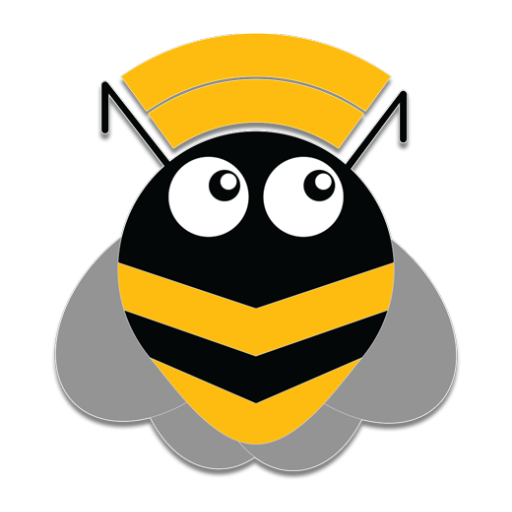

<!-- Shields -->


[](https://discordapp.com/invite/rceTb57)
[](https://gitter.im/musicbee-remote/Lobby?utm_source=badge&utm_medium=badge&utm_campaign=pr-badge&utm_content=badge)

<br/>
<p align="center">
    <a href="https://github.com/musicbeeremote/android-app">
    
    </a>

<h3 align="center">MusicBee Remote</h3>
    <p align="center">
        Application for controlling MusicBee through your Android Device 
        <br/>
        <a href="https://play.google.com/store/apps/details?id=com.kelsos.mbrc">Play Store</a>
        <br/>
        <br/>
        <a href="https://mbrc.kelsos.net/help/">Help</a>
        ·
        <a href="http://getmusicbee.com/forum/index.php?topic=7221.new;topicseen#new">MusicBee Forum</a>
        ·
        <a href="https://github.com/musicbeeremote/android-app/issues">Report Bug</a>
        ·
        <a href="https://github.com/musicbeeremote/android-app/issues">Request Feature</a>
    </p>
</p>

<!-- TABLE OF CONTENTS -->
## Table of Contents

* [About the Project](#about-the-project)
  * [Built With](#built-with)
* [Getting Started](#getting-started)
  * [Prerequisites](#prerequisites)
  * [Installation](#installation)
* [Usage](#usage)
* [Contributing](#contributing)
* [License](#license)
* [Contact](#contact)
* [Acknowledgements](#acknowledgements)

## About the Project

[![MusicBee Remote Screenshot][project-screenshot]](https://mbrc.kelsos.net)

MusicBee Remote is an application that allows you to control [MusicBee](http://getmusicbee.com/) player.
This is achieved by using a [plugin](https://github.com/kelsos/mbrc-plugin) that acts as a server.
The plugin exposes a TCP socket server and uses a JSON based protocol to communicate with the Android application.

The application development started in 2011 for personal usage and then it was open sourced and released to Play Store so others could use it. The application was also presented as part of my thesis title "*Android and application development for mobile devices*".

### Built With

* [Kotlin](https://kotlinlang.org/)
* [Architecture Components](https://developer.android.com/topic/libraries/architecture)
* [Koin](https://github.com/InsertKoinIO/koin)
* [Moshi](https://github.com/square/moshi)
* [mockk](https://mockk.io/)
* [rxjava](https://github.com/ReactiveX/RxJava)
* [arrow-kt](https://github.com/arrow-kt/arrow)
* [robolectic](http://robolectric.org/)

## Getting Started

In order to get started with the project as a developer there are a few steps you need to follow.

### Prerequisites

Android Studio should be installed on your local machine and it should be up to date.

During development the Canary version of the Android Studio is used, but for release versions the stable version of AGP is always preferred.

To get started with the the project you first have to clone the project.

```bash
git clone https://github.com/musicbeeremote/android-app.git
```

Then you can open the project with Android Studio.

### Installation

There is a number of ways you could install the application on your device. If you are a developer you can run install on Android Studio and that should take care of the installation.

Alternatively you could download a stable version of the Remote from [Play Store](https://play.google.com/store/apps/details?id=com.kelsos.mbrc).

The Play Store version of the remote include FireBase and Crashlytics and collects anonymous analytics.

Alternatively there is a GitHub version on the [releases](https://github.com/musicbeeremote/android-app/releases) page that doesn't include any Crash or analytics reporting for people that are cautious about their privacy.

## Usage

In order to use the application you need a working WiFi connection, that doesn't have [access point isolation](https://www.howtogeek.com/179089/lock-down-your-wi-fi-network-with-your-routers-wireless-isolation-option/).

You have to first install the [plugin](https://github.com/musicbeeremote/android-app/releases).

After installing the plugin if you are not prompted to allow MusicBee or the plugin through the Windows Firewall you might have to manually configure Windows Firewall to allow the plugin to receive connections.

For more detailed information you can check the [help](https://mbrc.kelsos.net/help/) page.

## Contributing

Contribution is always welcome.
The contribution guide should follow soon.

## License

The source code of the application is licensed under the [GPLv3](https://www.gnu.org/licenses/gpl.html) license. See `LICENSE` for more information.

    MusicBee Remote (for Android)
    Copyright (C) 2011-2019  Konstantinos Paparas

    This program is free software: you can redistribute it and/or modify
    it under the terms of the GNU General Public License as published by
    the Free Software Foundation, either version 3 of the License, or
    (at your option) any later version.

    This program is distributed in the hope that it will be useful,
    but WITHOUT ANY WARRANTY; without even the implied warranty of
    MERCHANTABILITY or FITNESS FOR A PARTICULAR PURPOSE.  See the
    GNU General Public License for more details.

    You should have received a copy of the GNU General Public License
    along with this program.  If not, see <http://www.gnu.org/licenses/>.

## Contact

MusicBee Remote - [@MusicBeeRemote](https://twitter.com/musicbeeremote)

Project Link: [https://github.com/musicbeeremote/android-app](https://github.com/musicbeeremote/android-app)

## Acknowledgements

* [Tasos Papazoglou Chalikias](https://github.com/sushiperv)

Tasos created many of the icons, and was responsible for the Holo design of the application. Most of the icons are licenced under the [Creative Commons Attribution-NonCommercial-NoDerivs 3.0 Unported License.](https://creativecommons.org/licenses/by-nc-nd/3.0/deed.en_US).

* [Jordan Georgiades](https://www.linkedin.com/in/jordan-georgiadis)

Jordan is responsible for the conception and creation of the application logo.

* Carlos Parga

Carlos created some really nice [mockups](https://groups.google.com/forum/#!topic/musicbee-remote/wgm029yfJnU) from where I drew inspiration while working on the UI.

* [Cyanogen Apollo player](https://github.com/CyanogenMod/android_packages_apps_Apollo)

Apollo Player was one of the original sources of inspiration for the UI of MusicBee Remote

* [Google Play Music for Android](https://play.google.com/store/apps/details?id=com.google.android.music)

[project-screenshot]: https://raw.githubusercontent.com/musicbeeremote/android-app/master/screenshot.png
